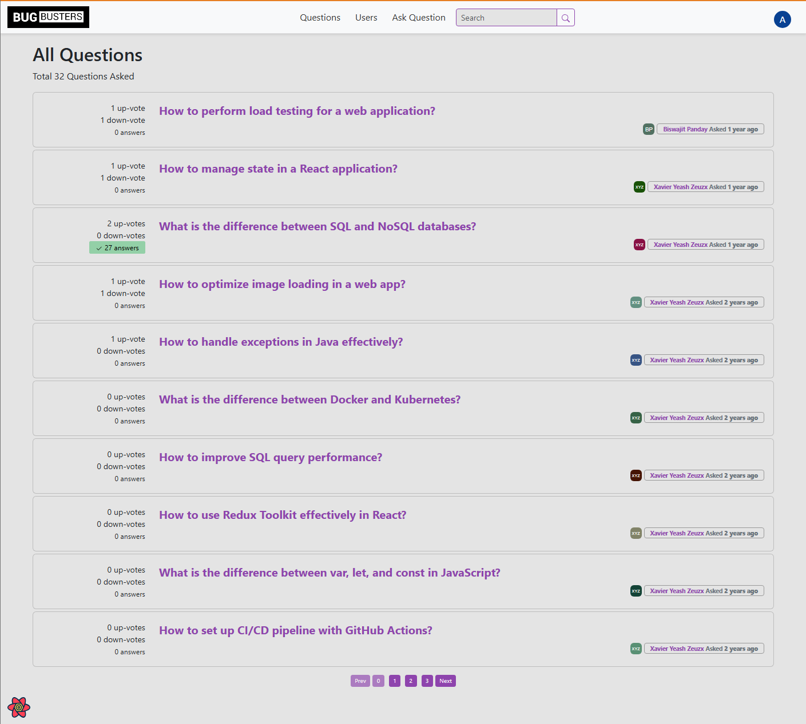
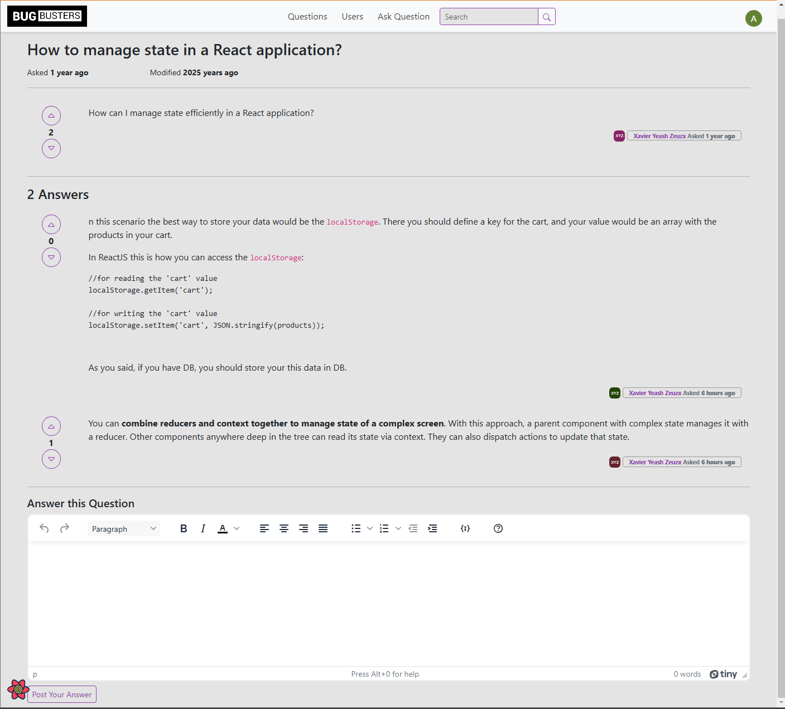
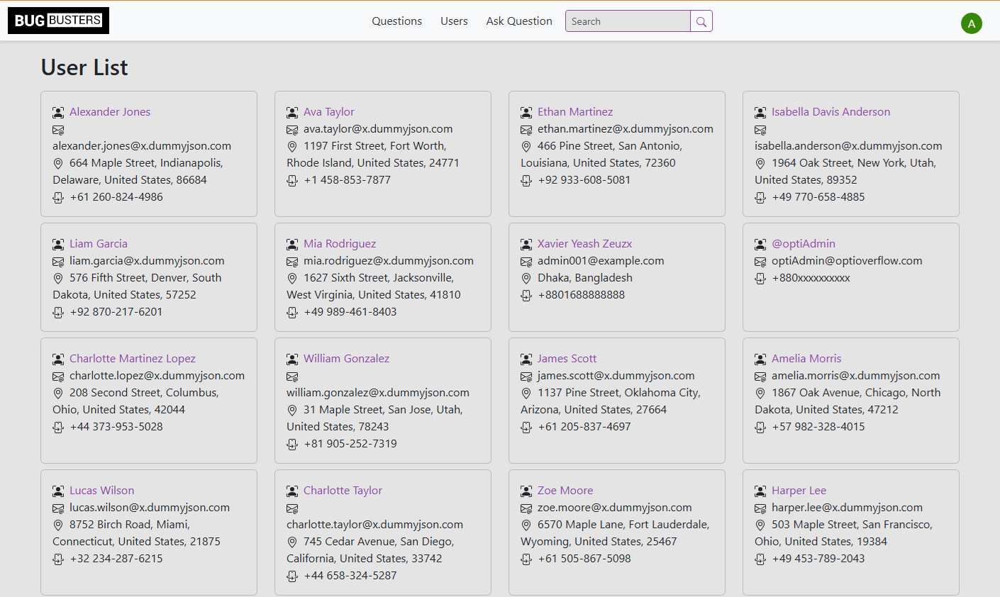
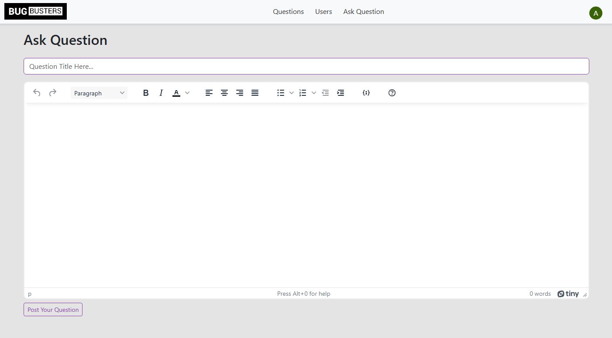

# Bug Busters Client

## Overview
The Bug Busters Client is a developer-centric platform designed to facilitate sharing issues and providing solutions within a company-specific environment. It is a smaller-scale version of StackOverflow, offering privacy and security for organizations that cannot share their problems on public forums.

### Features
- **User Management**: 
  - Registration and login capabilities.
  - User profile management.
  - Role-based access control.
- **Question and Answer Functionality**:
  - Users can post questions and provide answers.
  - Upvote and downvote mechanisms for content quality control.
  - Admin approval required for publishing questions or answers.
- **Search and Navigation**:
  - Search for questions and answers.
  - Organized navigation to browse through topics.

## Technology Stack
The application leverages modern web development tools and frameworks:

### Core Technologies
- **Frontend Framework**: React (18.2.0)
- **State Management**: React Query and Context API
- **Routing**: React Router DOM (6.12.0)
- **Styling**: Sass and Bootstrap (5.3.0)
- **Rich Text Editor**: TinyMCE and Stacks Editor
- **Testing**: Testing Library and Jest

### Additional Libraries
- **Utilities**: Axios, jwt-decode, uuid, clsx
- **UI Enhancements**: React Toastify, React Spinners, React Helmet Async
- **Other Tools**: TypeScript, Avatar ReactJS, React Lines Ellipsis

### Development Tools
- **Build Tool**: craco (Create React App Configuration Override)
- **Code Quality**: ESLint, TypeScript types
- **Version Control**: Git

## Project Structure
The application is organized as follows:
```
BugBusters.Client
├── .vscode
├── build
├── node_modules
├── public
├── src
│   ├── assets             # Static assets like images, fonts
│   ├── components         # Reusable UI components
│   │   ├── elements       # Buttons, spinners, etc.
│   │   ├── footer         # Footer component
│   │   ├── header         # Header component
│   │   ├── layout         # Layout components
│   │   └── pluralize      # Utilities for pluralization
│   ├── config             # Configuration files
│   ├── constant           # Constants used throughout the app
│   ├── features           # Core features like auth, questions, etc.
│   ├── lib                # Utility libraries
│   ├── pages              # Pages of the application
│   ├── providers          # Context providers for state management
│   ├── routes             # Application routes
│   ├── types              # TypeScript types
│   ├── utils              # General utility functions
│   ├── App.scss           # Global styles
│   ├── App.test.tsx       # App tests
│   ├── App.tsx            # Main app component
│   ├── index.css          # Entry CSS file
│   ├── index.tsx          # Entry JavaScript/TypeScript file
│   ├── reportWebVitals.ts # Performance metrics
│   └── setupTests.ts      # Test setup
├── .env                   # Environment variables
├── .gitignore             # Git ignore file
├── craco.config.js        # CRACO configuration
├── package-lock.json      # Dependency lock file
├── package.json           # Dependency manifest
├── README.md              # Documentation
├── tsconfig.json          # TypeScript configuration
├── tsconfig.paths.json    # TypeScript paths
```

## Getting Started

### Prerequisites
Ensure you have the following installed:
- Node.js (v16 or later)
- npm or yarn

### Installation
1. Clone the repository:
   ```bash
   git clone https://github.com/biswajitpanday/BugBusters.Client.git
   ```
2. Navigate to the project directory:
   ```bash
   cd BugBusters.Client
   ```
3. Install dependencies:
   ```bash
   npm install
   ```

### Running the Application
To start the development server:
```bash
npm start
```
The application will be available at [http://localhost:3000](http://localhost:3000).

### Building for Production
To create a production build:
```bash
npm run build
```
The build will be generated in the `build/` directory.

### Running Tests
To run the test suite:
```bash
npm test
```

## Screenshots

### Question List Page


### Question Description and Answer Page


### Users Page


### Ask Question Page


## Server Repository
The server-side code for this application can be found [here](https://github.com/biswajitpanday/BugBusters.Server).

## Contributing
We welcome contributions! Please follow these steps:
1. Fork the repository.
2. Create a feature branch.
3. Commit your changes.
4. Open a pull request.

## License
This project is licensed under the MIT License.

## Contact
For questions or support, please contact the repository maintainer at biswajitmailid@gmail.com.

---
Thank you for using Bug Busters Client!
